# **Real-time-collaborative-editor**

---

## **Live Demo**

Check out the live version of the project here:  
🔗 **[Project Live Demo](https://co-edit-live.netlify.app)**

---

## **Table of Contents**

1. [Overview](#overview)
2. [Features](#features)
3. [Tech Stack](#tech-stack)
4. [Installation](#installation)
5. [Environment Variables](#environment-variables)
6. [Testing Highlights](#testing-highlights)
7. [Contact](#contact)
8. [Team Members](#team-members)

---

## **Overview**

This project is a real-time collaborative platform built using the PERN stack (PostgreSQL, Express, React, Node.js). It offers a seamless experience for users to collaborate on shared files, featuring real-time synchronization.

## **Features**

- Real-time collaboration with **`Socket.IO`**.  
- Authentication via **JWT**.  
- RESTful API using **Express**.  
- **PostgreSQL** for database storage.  
- Password reset with **Nodemailer**.  
- Rich Text Editor with **CodeMirror**.
- Code Runner with **Piston API**

---

## **Tech Stack**

### **Frontend**:
- React.js (with React Router)
- Material UI
- Axios for API calls
- `Socket.IO` for real-time features
- Google OAuth
- CodeMirror

### **Backend**:
- Node.js
- Express.js
- `Socket.IO` for real-time features
- JWT for authentication
- Nodemailer
- Google OAuth
- Piston API

### **Database**:
- PostgreSQL 16


---

## **Installation**

1. **Clone the repository**:
   ```bash
   git clone https://github.com/ManojDhundhalva/CoEdit.git
   cd CoEdit
   ```
<br/>

2. **Install dependencies**:
   - Install backend dependencies:
     ```bash
     cd backend
     npm install
     ```
   - Install frontend dependencies:
     ```bash
     cd frontend
     npm install
     ```

<br/>

3. **Configure environment variables**:  
   Create a `.env` file in both `frontend` and `backend` directories. 
   See [Environment Variables](#environment-variables) for required keys.

<br/>

4. **Run the application**:
   - Start the backend:
     ```bash
     cd backend
     npm run start
     ```
   - Start the frontend:
     ```bash
     cd frontend
     npm run start
     ```
<br/>

5. Open [http://localhost:3000](http://localhost:3000) to view the application in the browser.

---

## **Environment Variables**

### Backend (`/backend/.env`):
```env
#PORT
PORT=YOUR_PORT

#SALT ROUNDS
SALT_ROUNDS=YOUR_SALT_ROUNDS

#JWT SECRET KEY
JWT_SECRET_KEY=YOUR_JWT_SECRET
JWT_TIMEOUT=YOUR_JWT_TIMEOUT

#SMTP
USER_EMAIL=YOUR_EMAIL
USER_PASS=YOUR_PASSWORD

#DATABASE URL
POSTGRES_URL=YOUR_DATABASE_URL

#FRONTEND URL
FRONTEND_URL=YOUR_FRONTEND_URL

#GOOGLE OAUTH
GOOGLE_CLIENT_ID=YOUR_GOOGLE_CLIENT_ID
GOOGLE_CLIENT_SECRET=YOUR_GOOGLE_CLIENT_SECRET

#MAIL VERIFICATION
ABSTRACT_API_KEY=YOUT_ABSTRACT_API_KEY 
```

### Frontend (`/frontend/.env`):
```env
#API URL
REACT_APP_BACKEND_API=YOUR_BACKEND_API

#GOOGLE OAUTH
REACT_APP_GOOGLE_CLIENT_ID=YOUR_GOOGLE_CLIENT_ID
```

---

### **Testing Highlights**

- **Unit Testing:**  
  - **Tools Used:** Jest, Vitest, Istanbul.  
  - **Results:** High coverage for backend (controllers, authentication) and frontend (React components).  
  - **Outcome:** Improved code quality and ensured early bug detection.

- **Black-Box Testing:**  
  - **Technique Used:** Equivalence Class Testing.  
  - **Key Scenarios Tested:** Valid/invalid login credentials, file and folder names, and boundary testing for adding collaborators.  
  - **Outcome:** Validated critical user workflows effectively.

- **Performance Testing:**  
  - **Tool Used:** JMeter (via BlazeMeter).  
  - **Metrics:**  
    - Max Users: 30  
    - Throughput: 44.07 Hits/Second  
    - Error Rate: 0.05%  
    - Avg Response Time: 1274.27 ms  
    - 90% Response Time: 1859 ms  
  - **Outcome:** Efficient handling of concurrent users and low error rates.

- **Compatibility Testing:**  
  - **Platforms Tested:** Windows 11 with Chrome, Brave, Firefox, and Opera Mini.  
  - **Outcome:** Seamless performance across browsers and platforms.

- **Reliability Testing:**  
  - **Results:**  
    - Uptime: 100% over 7 days (0 incidents).  
    - Avg Response Time: 209 ms  
  - **Outcome:** Proven stability and consistent availability.

- **GUI Testing:**  
  - **Tool Used:** Selenium IDE.  
  - **Key Scenarios Tested:** Authentication, real-time editing, file management, and collaborative workflows.  
  - **Outcome:** Ensured the interface is user-friendly and responsive.

- **Acceptance Testing:**  
  - **Approach Used:** Test cases based on functional requirements and user stories.  
  - **Outcome:** Confirmed alignment with business requirements and readiness for deployment.  
  
---

## **Contact**
 
**Email**: [coedit.service@gmail.com]  

---

To add a team members list to your project documentation, you can include a section like this under a new heading in the document:

---

## **Team Members**

Here is a list of team members who contributed to this project:

- **Manoj Dhundhalva** - Project Leader
- **Pratham Patel** 
- **Meshv Patel** 
- **Dishank Thakkar**
- **Hardi Naik** 
- **Divykumar Tandel** 
- **Kishan Pansuriya** 
- **Maunil Modi** 
- **Shravankumar Makwana**
 

---

### **Screenshots**  
Include screenshots or GIFs to showcase the application functionality.

1. [Login Page](#login-page)
2. [SignUp Page](#signup-page)
3. [Google-OAuth](#google-oauth)
3. [Forgot Password](#forgot-password)
4. [Home Page](#home-page)
5. [Profile](#profile)
6. [Project Page](#project-page)
7. [Code Editor](#code-editor)

### `Login Page`
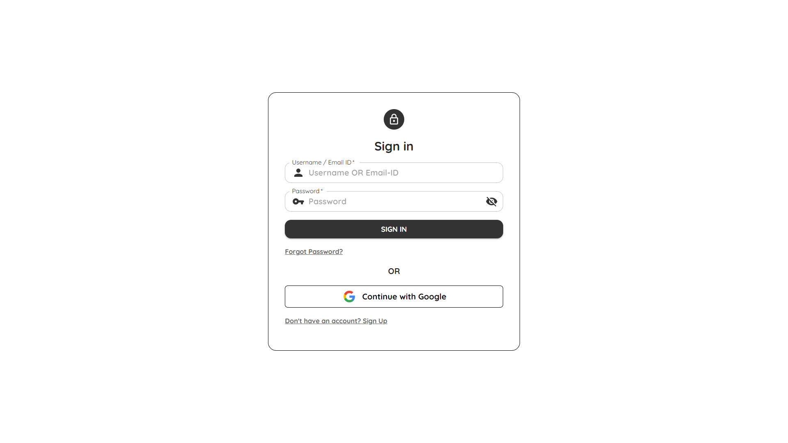

### `SignUp Page`
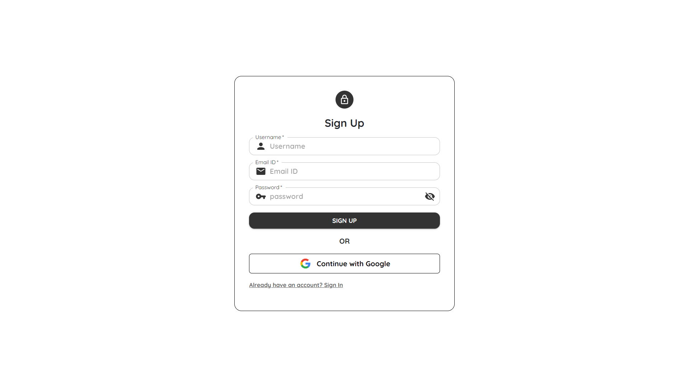

### `Google OAuth`
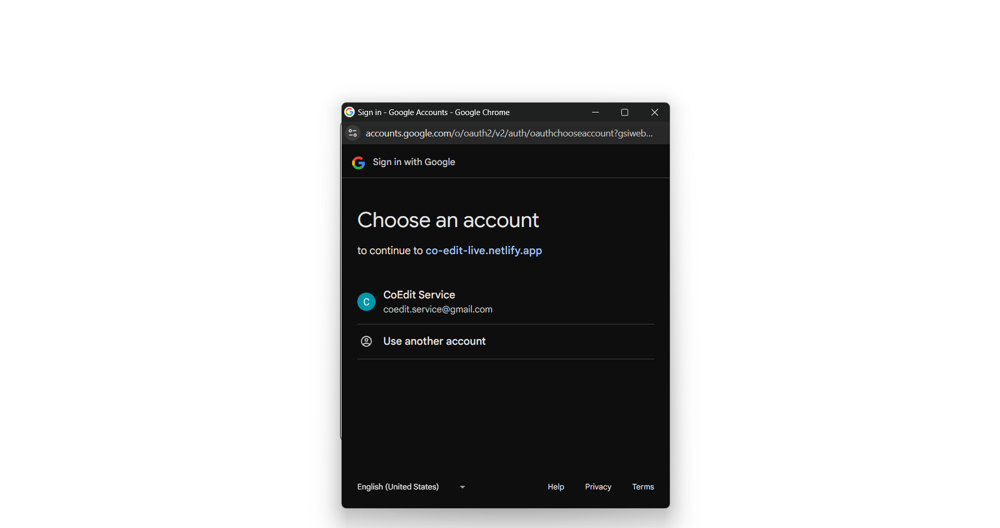
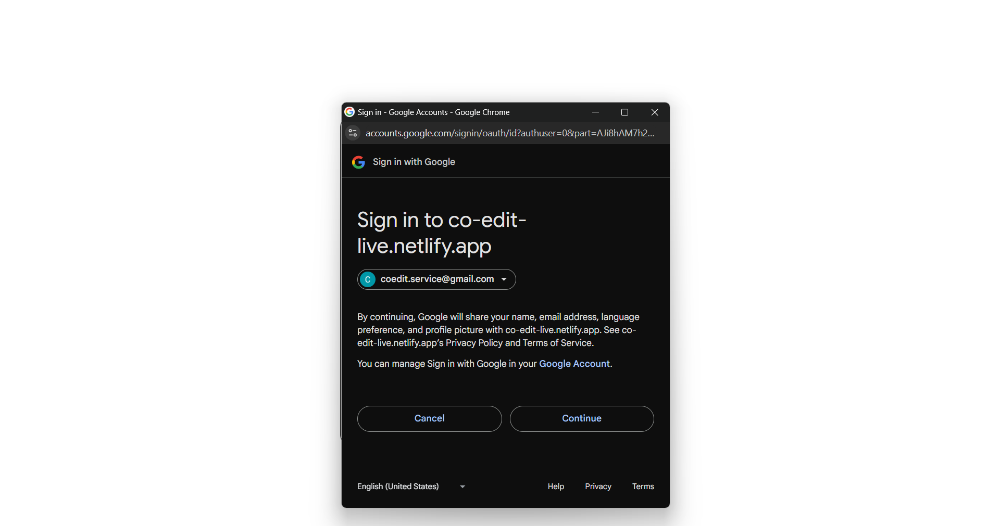


### `Forgot Password`
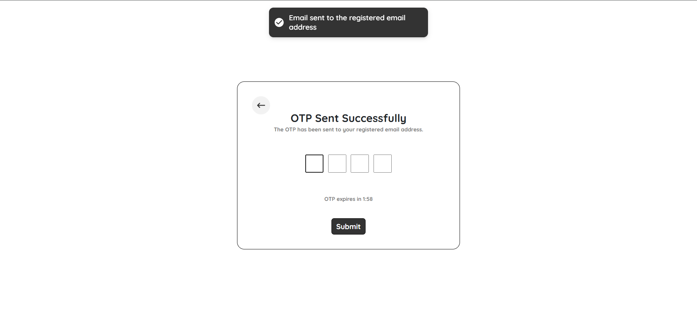

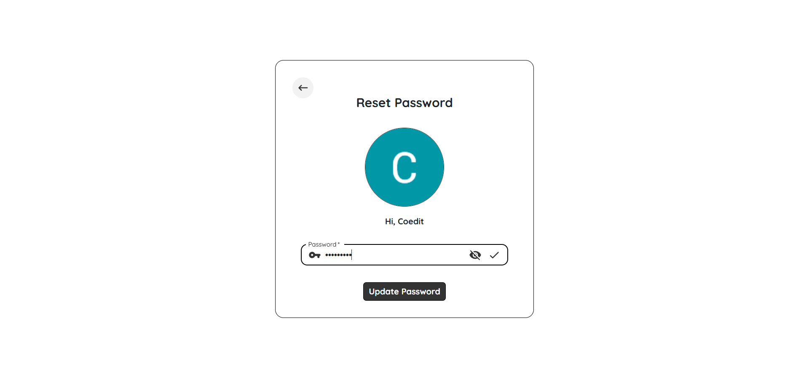

### `Home Page`
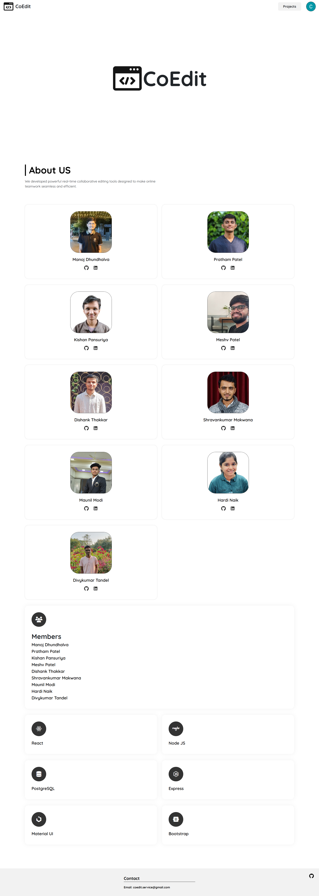

### `Profile`


### `Project Page`
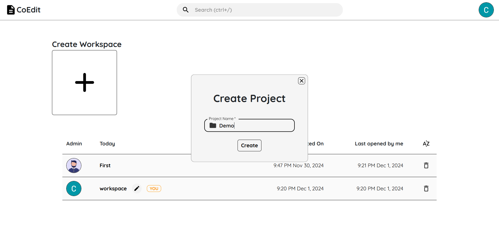
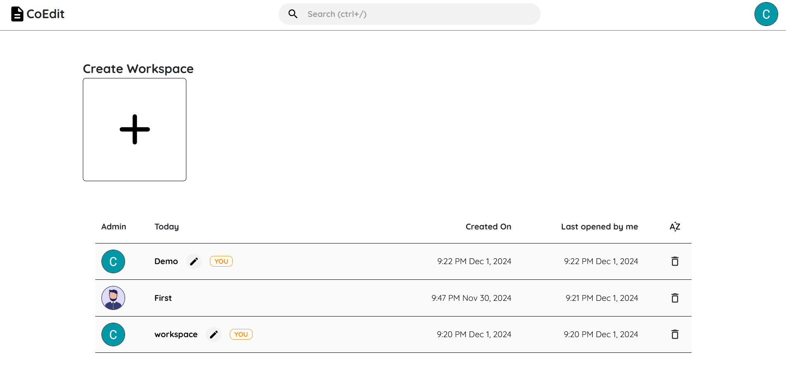

### `Code Editor`
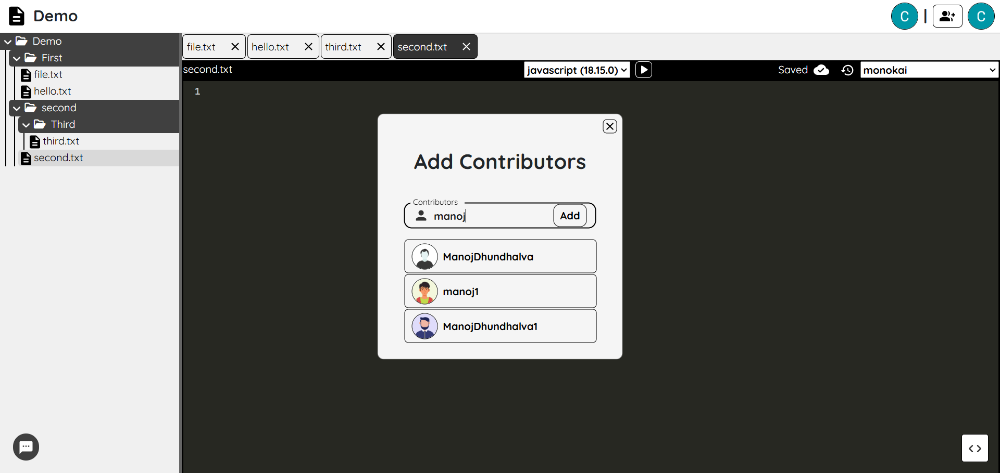
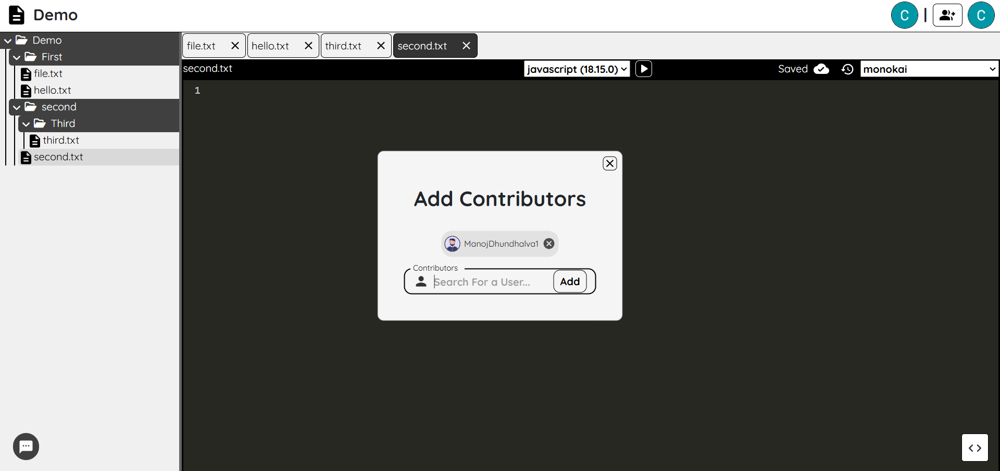

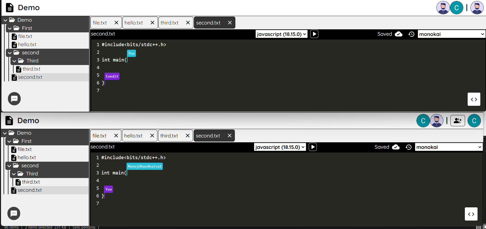
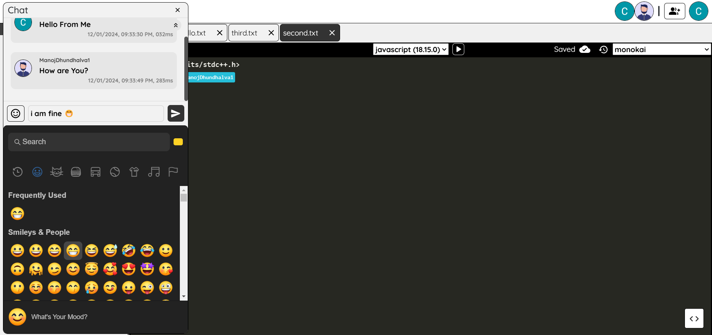


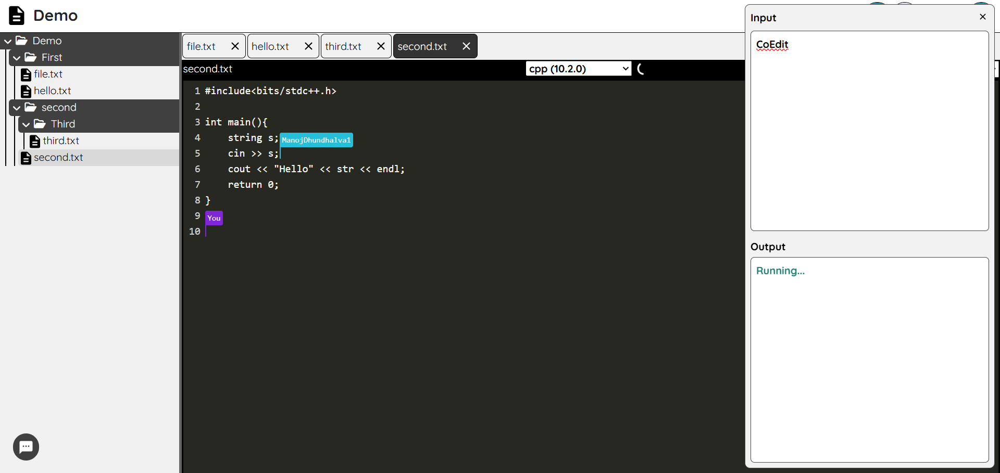


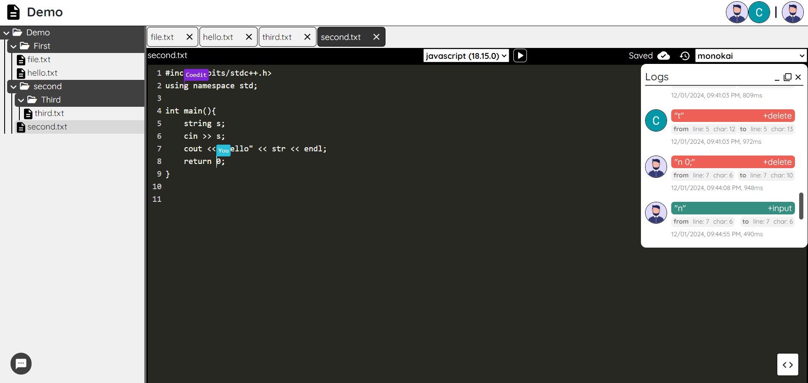


---
<div style="text-align: center; font-weight: bold">
   - CoEdit Team -
</div>
